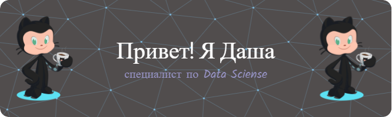

На этой странице ты найдёшь портфолио моих проектов, разработанных с использованием передовых методов анализа данных и машинного обучения. Каждый проект основан на глубоком исследовании, статистическом моделировании и предоставляет ценные практические результаты.

### Моя экспертиза охватывает следующие области:

* Исследовательский анализ данных
* Прогнозирование и моделирование
* Машинное обучение и глубокое обучение
* Визуализация данных
* Автоматизация и оптимизация процессов

Я постоянно стремлюсь к самосовершенствованию и изучению новейших методов и инструментов в области анализа данных, чтобы достичь сильных и прогрессивных результатов.
### Мои проекты
Приглашаю тебя ознакомиться с моими проектами, изучить мой код и обсудить возможности сотрудничества. Я всегда открыт для работы в команде и совместного исследования новых данных, а также для обмена знаниями и опытом.

| Название проекта | Описание | Используемые библиотеки |
| :-------------------- | :---------------------------: |:---------------------------:|
| [Games platform](https://github.com/DariOrlova/project_yandex/tree/main/games_platform_project)| Прогнозирование популярности игровых платформ для планирования рекламных компаний | SciPy, Matplotlib, Pandas |
| [Gold Recovery Prediction](https://github.com/DariOrlova/project_yandex/tree/main/gold_project) | Проект разработан для предсказания коэффициента восстановления золота из руды и оптимизации производственных процессов. Эта модель машинного обучения позволяет предотвратить запуск убыточных предприятий, оптимизировать производство и повысить эффективность добычи золота. |Pandas, Numpy, Matplotlib, Seaborn, Sclearn|
| [Telecom project](https://github.com/DariOrlova/project_yandex/tree/main/telecom_project) | Данный проект посвящен разработке модели прогнозирования оттока клиентов в операторе связи. Цель проекта заключается в идентификации пользователей, которые вероятно планируют прекратить пользоваться услугами оператора, чтобы принять соответствующие меры и предложить им промокоды и специальные условия с целью удержания. | Pandas, NumPy, Matplotlib, Seaborn, Scipy, Sklearn, Lightgbm, Catboost |

### Ты можешь связаться со мной через следующие каналы: 

Email:    [darianaorlowa@yandex.ru]

Telegram: [https://t.me/daria_or_lova]
  
Добро пожаловать в мой аналитический мир, где мы вместе исследуем данные и находим ценные инсайты для принятия информированных решений!
